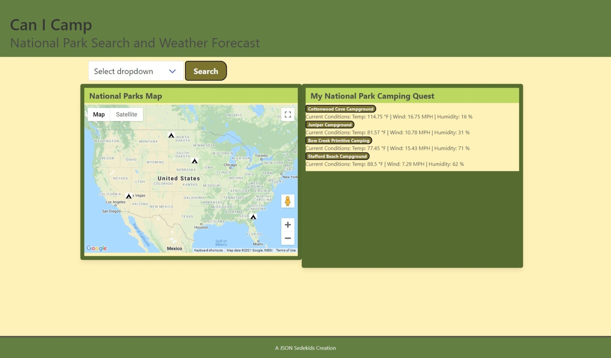

# Project1 - National Parks Campground 

Have you ever wondered where you can enjoy a national park campground? You only need to know where you are headed and if the weather is good enough to go camping! The outdoorsy type isn’t interested in getting bogged down in internet soup. They want to enjoy the outdoors! This application cuts out the fat and gives the user the most important information right away.

### Look no further. 

Utilizing the National Parks Service API, Google Maps API, and the Open Weather API, we have created a search engine just for you.
Personalize the map with your favorite locations simply by clicking on the camping icons and re-draw the map!

### User Story

As an avid camper, I WANT to search for all of the National Park campgrounds in my state.
SO THAT I can generate a bucket list of national parks across the country to visit.

### Challenges

Integrating the correct data from one API to another can be tricky. It's important to verify that the fetched data is accurate. 

Bulma was a great new challenge for all of us. We really enjoyed the column layout of the CDN.

# Technology Used

### Languages
HTML
CSS
JAVASCRIPT
JQUERY
BULMA

### APIs

Google Maps API
National Parks Service API
Open Weather API

# Access and How-to

Using the dropdown menu at the top of the page, you can select a state of your choice. Once selected, a list of campgrounds will pop up on the map. Each campground has a description and a photo. You can select different campgrounds and add them to your saved searches to the right of the map. When you refresh the page, the map re-centers itself on your saved searches.

You can view the live application at this link provided. [Live-app](https://awolrob.github.io/Project1/)

The longitude and latitude are hard coded in the js code (line 2) for Australia - changed to local log lat.  Add another marker call for another long lat.

Using google Maps for JAvascript in theory we can learn the API query requirements to send the API a list of PIN points to label and display.

# Credits:

### Collaborators

[Patrick-Ginley](https://github.com/GinleyP87)

[Max-Fausnight](https://github.com/fausnightm)

### Sources

1) https://developers.google.com/maps/documentation/javascript/examples/marker-simple#maps_marker_simple-css

2) https://developers.google.com/maps/documentation/javascript/overview?hl=en_US
 
4) https://gist.github.com/mshafrir/2646763

5) https://gist.github.com/meiqimichelle/7727723